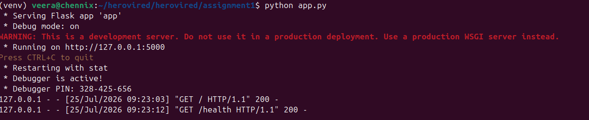

# Password Manager – Flask REST API

## Project Description
This is a simple in-memory password manager built with Python and Flask.
It lets you store a username and password, retrieve a stored password by
username, and delete a stored record. All data lives in memory only (no
database), so it resets whenever the server restarts. It was built to
practice REST API design and Git branching workflows.

## Installation and Setup Steps

1. Clone the repository
   ```
   git clone <your-repo-url>
   cd <your-repo-folder>
   ```
2. (Optional but recommended) Create a virtual environment
   ```
   python3 -m venv venv
   source venv/bin/activate      # on Windows: venv\Scripts\activate
   ```
3. Install dependencies
   ```
   pip install -r requirements.txt
   ```
4. Run the application
   ```
   python app.py
   ```
5. The app will be available at `http://localhost:5000`

## API Endpoint Reference

| Endpoint            | Method | Description                                  | Example Response |
|----------------------|--------|-----------------------------------------------|-------------------|
| `/`                  | GET    | Welcome message                               | `Welcome to the App` |
| `/health`            | GET    | Health check                                  | `App is running` |
| `/add`               | POST   | Adds a username/password pair. Body: `{"username":"veera","password":"secret123"}` | `{"message": "User 'veera' added successfully"}` |
| `/get/<username>`    | GET    | Returns the stored password for a username    | `{"username": "veera", "password": "secret123"}` |
| `/delete/<username>` | DELETE | Deletes the stored record for a username       | `{"message": "User 'veera' deleted successfully"}` |

Errors (e.g. missing fields, username not found) return JSON with an
`"error"` key and an appropriate HTTP status code (400 or 404).

### Testing with curl
```
curl http://localhost:5000/
curl http://localhost:5000/health
curl -X POST http://localhost:5000/add -H "Content-Type: application/json" -d "{\"username\":\"veera\",\"password\":\"secret123\"}"
curl http://localhost:5000/get/veera
curl -X DELETE http://localhost:5000/delete/veera
```

## Git Workflow
All development happened on the `dev` branch first. Once a feature was
complete and tested locally, `dev` was merged into `main`, and only
`main` was pushed as the stable, releasable version. This mirrors how
real teams keep `main` deployable at all times while `dev` (or a feature
branch) absorbs in-progress work.

```
main   ●────────────●───────────────●
        \           ^ (merge V1)   ^ (merge V2)
dev      ●──●──●────'      ●──●────'
        (/,/health,       (/delete
         /add,/get)        endpoint)
```

## Version History

| Version | Branch flow | Included |
|---------|-------------|----------|
| **V1** | `dev` → merged into `main` | `/`, `/health`, `/add`, `/get/<username>` |
| **V2** | `dev` → merged into `main` | Adds `/delete/<username>` on top of V1 |

## Real-World Extension (Bonus)
To connect this exercise to actual infrastructure automation work, the
same repo also includes a second small Flask app that follows the exact
same `dev` → `main` versioning pattern:

**`extension_v1_app.py` (Version 1)**
| Endpoint | Method | Description |
|---|---|---|
| `/` | GET | Welcome message |
| `/health` | GET | Health check |
| `/server-status/<hostname>` | GET | Real `ping` check against a target host, returns up/down |
| `/register/<hostname>` | POST | Registers a server into an in-memory CMDB-style inventory (`os`, `env`) |
| `/inventory` | GET | Returns the full registered inventory as JSON |

**`extension_v2_app.py` (Version 2 — built on top of V1, adds one endpoint)**
| Endpoint | Method | Description |
|---|---|---|
| `/trigger-job/<template_id>` | POST | Launches an AWX job template via AWX's REST API and returns the job ID/status |

The V2 file is additive only — every V1 endpoint is unchanged, and the
new endpoint pulls its AWX URL/token from environment variables rather
than hardcoding credentials, following the same secret-handling pattern
used in production automation.

**Git commands to version this the same way as the main app:**
```
git checkout dev
git add app.py
git commit -m "Extension V1: Add inventory + host status check app"
git push origin dev
git checkout main
git merge dev
git push origin main

```

## Screenshots
**App running in terminal status:**

